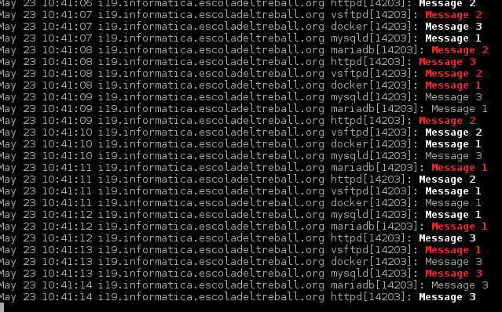

% Generació massiva de logs
% Alex del Valle
% May 2016

# Introducció

**Descripció**: Tots els projectes necessitaran grans volums de logs, de tipus diferents, per posar a prova els seus sistemes. Aquest és un projecte al servei de la resta per facilitar aquesta generació massiva de logs.

**Objectiu**: Generació massiva de logs

# Eines utilitzades

- Sistema Fedora 20
- Bash
- Python
- Apache
- Docker
- ab
- wget

# Primers passos

## Què són els logs?

Són registres oficials del sistema, responen a les 5 W.

- **W**ho
- **W**hat
- **W**hen
- **W**here
- **W**hy

## Tipus de logs

- Debug
- Info
- Notice
- Warning
- Warn
- Err
- Error
- Crit
- Alert
- Emerg
- Panic

  
## Syslog i Journal

Abans, en els sistemes l'eina utilitzada per registrar i visualitzar els logs era **syslog**.

Actualment, amb l'arribada de *systemd*, l'eina més utilitzada és **journalct**. Com que el sistema que hem fet servir es Fedora 20
em centraré en el **journal** per tot el desenvolupament del projecte.

## Generar logs

És l'objectiu del projecte.

Aquests logs seràn redirigits al journalctl del sistema.

# Comencem a generar logs

## Com generem logs?

- Scripts Python
- Scripts Bash
- Serveis
- Containers Docker amb servei Apache
- Peticions massives [ab i wget]

## Python

Gràcies als mòduls **syslog** y **logging**.

## Bash

Fent ús de la utilitat **logger**.

## Services

Creant un servei al sistema mitjançant els scripts de Python o Bash.

## Docker

Creant containers amb un servei Apache actiu.

## Peticions massives als containers

- ab
- wget

# Conclusions

## Conclusions

- Aprendre a gestionar i treballar amb un respositori git
- Treballar en un entorn adequat
- Funcionament logs
- Generació logs
- Correcta documentació

## Opinió personal

Aprende a desenvolupar-se.
Utilització d'eines i recursos apresos durant el cicle.

